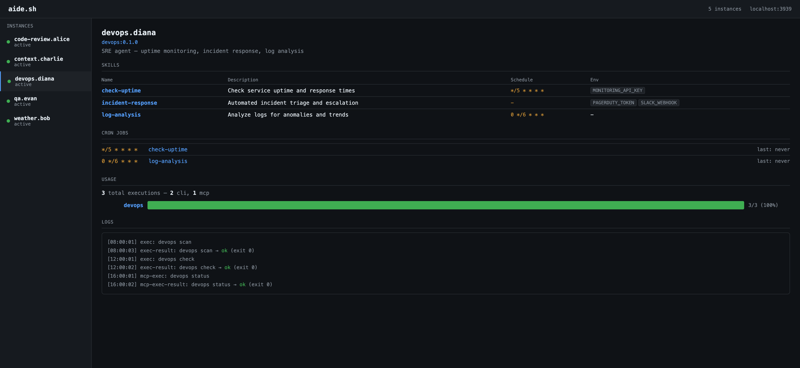

# aide.sh

**Deploy AI agents, just like Docker.**

aide.sh is a CLI tool for packaging, deploying, and managing AI agents. One Rust binary, no runtime dependencies.

## Why aide.sh?

- **Docker mental model** — `build`, `run`, `exec`, `push`, `pull`. If you know Docker, you know aide.sh.
- **Works without AI** — agents are structured skill runners (shell scripts). No LLM required.
- **Three execution modes** — ad-hoc (human drives), sub-agent (LLM drives via MCP), standalone (`-p` flag: agent has its own LLM brain).
- **Local-first** — agents run on your machine, secrets stay in your encrypted vault.
- **MCP native** — Claude Code, Codex, Gemini can control your agents as subagents.

## Quick taste

```bash
# install
curl -fsSL https://aide.sh/install | bash

# pull an agent from the hub
aide pull aide/github-reviewer
aide run aide/github-reviewer --name reviewer

# use it — no AI needed
aide exec reviewer pr list
aide exec reviewer diff

# or let AI decide what to call
aide exec -p reviewer "are there any PRs that need review?"

# monitor everything
aide dash
```

**What does `-p` do?** It gives the agent a brain. Without `-p`, you call skills directly by name. With `-p`, an LLM (Claude CLI or local ollama) reads the agent's persona and skill list, interprets your natural language query, and decides which skills to invoke.

## Dashboard



Built-in observability. See every agent's skills, cron jobs, usage analytics, and logs — all in one place.

## How it works

```
Agentfile.toml          ← agent manifest (like Dockerfile)
├── persona.md          ← agent personality
├── skills/*.sh         ← executable capabilities (shell scripts)
├── seed/               ← initial knowledge
└── [limits]            ← timeout, token budget, retry policy

aide build agent/    → .tar.gz archive
aide push agent/     → upload to hub
aide pull user/agent → download from hub
aide run user/agent  → create instance
aide exec inst skill → run a skill
aide up              → daemon: cron + dashboard
```

## Next steps

- [Installation](./getting-started/install.md) — get the binary
- [Quick Start](./getting-started/quickstart.md) — build your first agent in 5 minutes
- [Concepts](./getting-started/concepts.md) — images, instances, skills, vault
- [Execution Modes](./arch/semantic-injection.md) — ad-hoc, sub-agent, standalone
