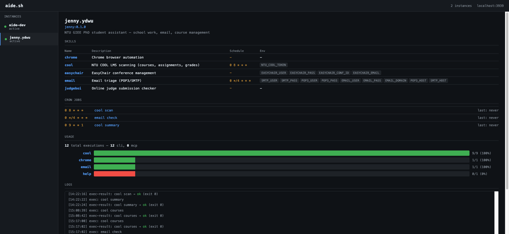

# Dashboard

aide.sh includes a built-in web dashboard for monitoring agents.



## Quick start

```bash
aide.sh dash                  # standalone dashboard
aide.sh up                    # daemon + cron + dashboard
aide.sh up --no-dash          # daemon without dashboard
```

Dashboard serves at `http://localhost:3939`.

## Panels

- **Instances** — sidebar listing all agents with status dots (green = active)
- **Skills** — table with name, description, cron schedule, env vars
- **Cron Jobs** — schedule, skill name, last run time
- **Usage** — per-skill execution bars with success/fail ratio, CLI vs MCP breakdown
- **Logs** — real-time log tail with auto-refresh (3s polling)

## API

```bash
# List all instances
curl http://localhost:3939/api/instances

# Instance detail (skills, cron, metadata)
curl http://localhost:3939/api/instance/jenny.ydwu

# Logs (latest N lines)
curl http://localhost:3939/api/logs/jenny.ydwu?tail=50

# Usage analytics
curl http://localhost:3939/api/stats/jenny.ydwu
```

## Stats response

```json
{
  "total_execs": 12,
  "by_skill": {
    "cool": { "count": 9, "success": 9, "fail": 0 },
    "email": { "count": 1, "success": 1, "fail": 0 }
  },
  "by_source": { "cli": 12, "mcp": 0 }
}
```
